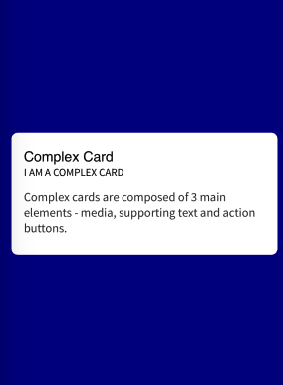
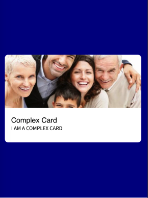
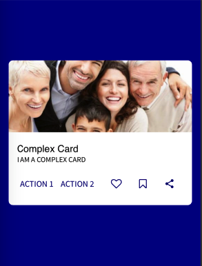
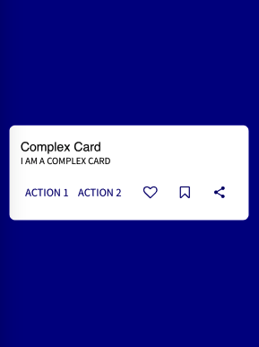
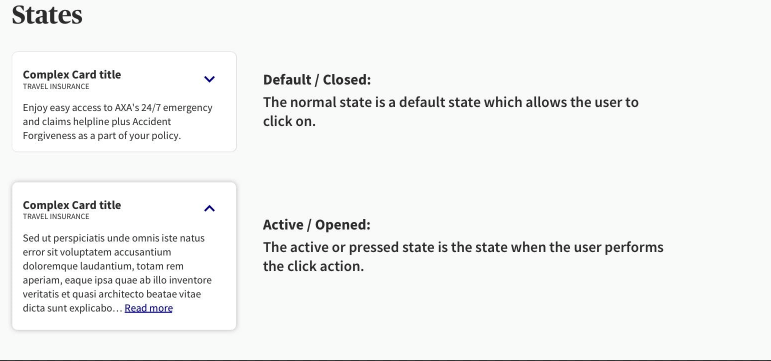
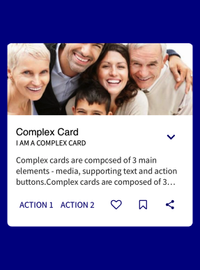
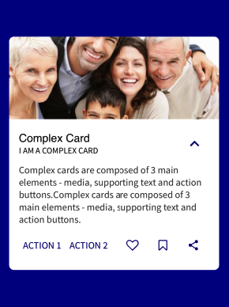

Complex cards are composed of **3 main elements - media, supporting text and action buttons**. You can mix and match these elements depending on the content you want to communicate to your user. 





That give the complex Card a great flexibility as it's shape can vary.









### Usage

To achieve a complex card, we provide you a _BaseCard_ wich is a basic card. You can provide the props you want to display as it shape may vary following your need. At leat a title and a Subtitle are required for a _BaseCard_.

````javascript
const MyComponent = () => (
  <BaseCard image={someImage} title="Complex Card" subtitle="I am a Complex Card"  onPress={() => console.log('Pressed')}>
    The text do display inside the Card goes here !
  </BaseCard>
);

````


## Props 

### title
Type: String

_title to display for the Card.

### subtitle
Type: String

subtitle to display for the Card._

### image
Type: image

_Image to display for the Card._

### multiline
Type: boolean

_If the text of your card is can not fit in 3 lines, you will need to provide this props. It will activate the toggleButton for your card and adds the text toggling functionnality._

### cta
Type: boolean

_This give activate the CTA part of the Card (bottom of the card with call to action buttons and icons)_

### actionTitle
Type: String

_Title for the firt action of the Card_

### action
Type: () => void

_Callback function for the first action of the Card_


### actionTitle2
Type: String

_Title for the second action of the Card_

### action2
Type: () => void

_Callback function for the second action of the Card_

### onLike
Type: () => void

_Callback function for the like icon of the Card_


### onSave
Type: () => void

_Callback function for the Save(Bookmark) icon of the Card_

### onShare
Type: () => void

_Callback function for the Share icon of the Card_


_Function to execute on press._


