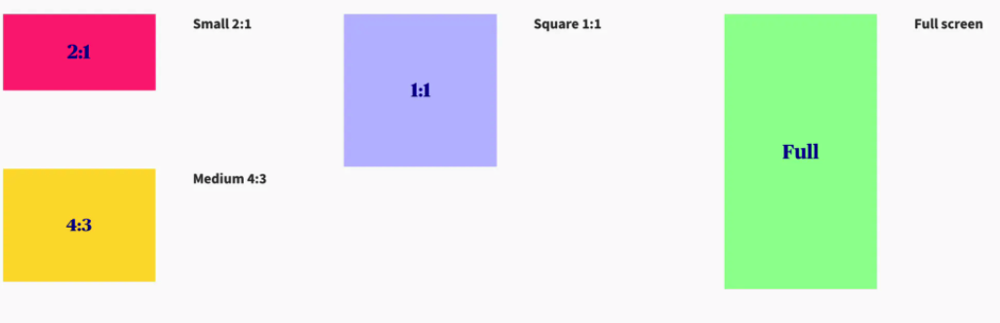
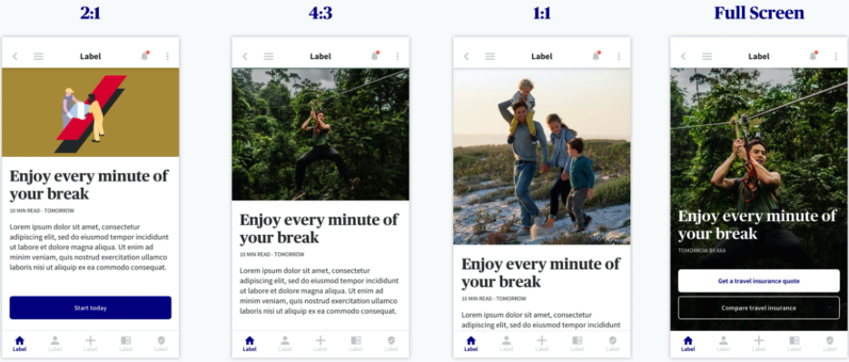

Similar to Hero covers used in Web design, on mobile this component serves to communicate content, accompanied by a some kind of visual element. In your mobile applications **you can use covers either with a CTA, which invites to take action, or as banners to written content.**


## Types of covers

When deciding what cover to chose, you need to consider two things - **the size available you have on the screen, and the visual media you want to use.**

## Type

You can use 3 types of media - an illustration, a photo or a video.

## Size

You can choose from 4 different sizes fro your media content, depending on the context and media you would like to use.



## Design

Using a cover can add a strong element to your mobile interface, but you should be careful on how it lives with the rest of the components on the screen in order to ensure legibility.




### Usage

To achieve a Cover, we provide you a _Cover_ API. this API is used to display both Videos and Images. 

````javascript
const MyComponent = () => (
  <Cover src={myVideo} isVideo size="full" />
);

````


````javascript
const MyComponent = () => (
  <Cover src={myImage} size="medium" />
);

````


## Props 

### src
Type: any

_The file you want to display._

### isVideo
Type: booelan

_To specify wether or not your file is a video, this prop is REQUIRED when you want to display a video._

### Size
Type: string

_Size of the video. You can choose between 4 differents sizes : small, medium, square and full. If this prop is not provided then it will default to small._


