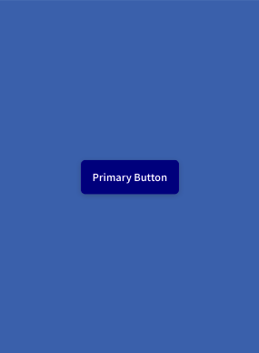
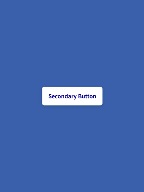
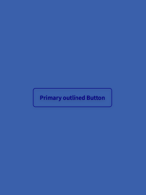
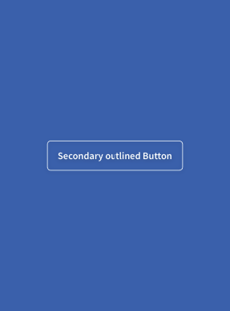

# Getting Started with Buttons

A button is component that the user can press to trigger an action. All Buttons have normal, active and disabled state.

_Normal : Normal State of Button
Active : When the Button is pressed
Disabled: When the Button is disabled_

## Primary Button
Used to indicate the main action of a page/form which going with the user’s decision on making this action.



### Usage

We get this primary button by adding a **primary** prop to the button API.

````javascript
const MyComponent = () => (
  <Button icon={someIcon} primary onPress={() => console.log('Pressed')}>
    Primary Button
  </Button>
);
````

## Secondary Button
Used to indicate the main action of a page/form which going with the user’s decision on making this action.



### Usage

We get this secondary button by adding a **secondary** prop to the button API. 

_NB_: If by mistake you provide **primary** and **secondary** props at the same time to the same Button, then the default mode will be primary.

````javascript
const MyComponent = () => (
  <Button icon={someIcon} secondary onPress={() => console.log('Pressed')}>
    Secondary Button
  </Button>
);
````

## Primary Outlined Button
Often used to highlight a secondary action.



### Usage

We get this button by adding **primary** and **outlined** prop to the button API. 

_NB_: If by mistake you provide **primary** and **secondary** props at the same time to the same Button, then the default mode will be primary outlined.

````javascript
const MyComponent = () => (
  <Button icon={someIcon} primary outlined onPress={() => console.log('Pressed')}>
    Primary Outlined Button
  </Button>
);
````

## Secondary Outlined Button
Often used to highlight a secondary action.



### Usage

We get this button by adding **secondary** and **outlined** prop to the button API. 

_NB_: If by mistake you provide **primary** and **secondary** props at the same time to the same Button, then the default mode will be primary outlined.

````javascript
const MyComponent = () => (
  <Button icon={someIcon} secondary outlined onPress={() => console.log('Pressed')}>
    Secondary Outlined Button
  </Button>
);

````

## Props 

### Type

**primary | secondary | primary outlined | secondary outlined**

_Mode of the button. You can change the mode to adjust the styling to give it desired emphasis. Usually you will use **primary** mode for light backgrounds and **secondary** for dark one._


### block
Type: boolean

_Using this prop will make the Button take all available width in screen._


### icon
Type: IconSource

Icon to display for the Button.

### iconColor 
Type: string

_Custom text color for icon, default color is white._


### disabled
Type: boolean

_Whether the button is disabled. A disabled button is greyed out and onPress is not called on touch.
_

### onPress
Type: () => void

_Function to execute on press._


### style
Type: StyleProp
Style of button's inner content. Use this prop to apply custom height and width.
