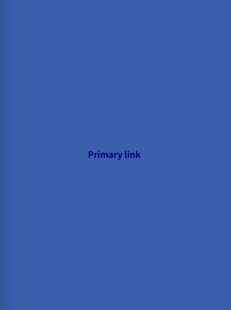
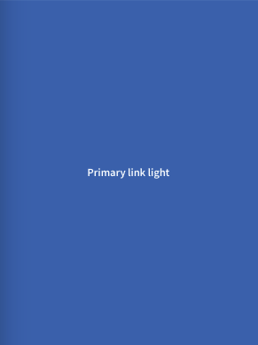
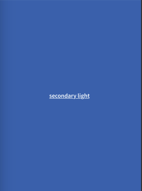
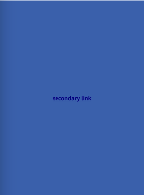

# Getting Started with Links

Usually used for supportive actions to a specific component to come up with more options to the main task.

## Primary Link



### Usage

We get this primary Link by adding a **primary** prop to the link API.

````javascript
const MyComponent = () => (
  <Link primary onPress={() => console.log('Pressed')}>
    Primary Link
  </Link>
);

````

````javascript
const MyComponent = () => (
  <Link primary light onPress={() => console.log('Pressed')}>
    Primary Link Light
  </Link>
);

````

## Secondary Link



### Usage

We get this secondary button by adding a **secondary** prop to the link API. 

_NB_: If by mistake you provide **primary** and **secondary** props at the same time to the same Link, then the default mode will be primary.

````javascript
const MyComponent = () => (
  <Link primary onPress={() => console.log('Pressed')}>
    Secondary Link
  </Link>
);

````

````javascript
const MyComponent = () => (
  <Link primary light onPress={() => console.log('Pressed')}>
    Secondary Link Light
  </Link>
);

````

## Props 

### Type

**primary | secondary**

_Mode of the link. You can change the mode to adjust the styling to give it desired emphasis._

### light
Type: boolean

_This will give a light tint to link and icons. Used often for dark Backgorunds.
_

### block
Type: boolean

_Using this prop will make the Link take all available space in screen._


### prevIcon
Type: IconSource

Icon to display before the Link label.

### nextIcon
Type: IconSource

Icon to display after the Link label.

### visited
Type: boolean

_Whether the button is visited. A visited link is blued out and onPress is still going to work.
_

### onPress
Type: () => void

_Function to execute on press._


### style
Type: StyleProp

Style of button's inner content. Use this prop to apply custom height and width.
