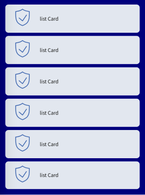
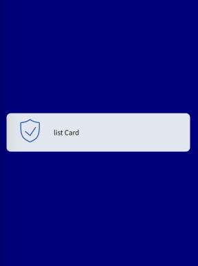

Depending on the context, sometimes **you might need to have more card elements than what you can fit on the mobile screen**. If that is the case, you can re-direct your user to the _card lists_.





### Usage

````javascript
const MyComponent = () => (
  <ListCard icon={someIcon} text="List Card" primary onPress={() => console.log('Pressed')}>
);

````


## Props 

### text
Type: String
Text to display for the Card._

### icon
Type: IconSource
_Icon to display for the Card._


### onPress
Type: () => void

_Function to execute on press._


