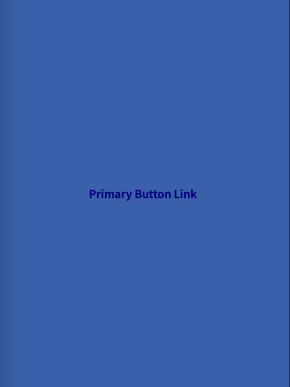
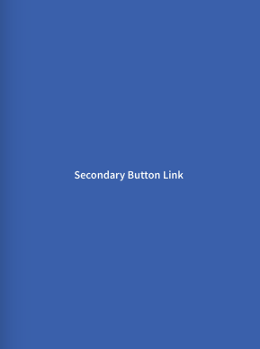

This is a special type of Button/Link, wich can be disabled. Usually used for supportive actions to a specific component to come up with more options to the main task.

We get this Button/Link by providing a **Link** alongside **primary/secondary** combined with **outlined** prop to the button API. 

Button/Link have normal, active and disabled state.

_Normal : Normal State of Button
Active : When the Button is pressed
Disabled: When the Button is disabled_


_NB_: If by mistake you provide **primary** and **secondary** props at the same time to the same Button, then the default mode will be primary.




### Usage

````javascript

const MyComponent = () => (
  <Button primary outlined link onPress={() => console.log('Pressed')}>
    Primary Outlined Button
  </Button>
);

````

````javascript

const MyComponent = () => (
  <Button secondary outlined link onPress={() => console.log('Pressed')}>
    Secondary Outlined Button
  </Button>
);

````

## Props 

### Type

**primary outlined link | secondary outlined link**

_Mode of the button. You can change the mode to adjust the styling to give it desired emphasis. Usually you will use **primary** mode for light backgrounds and **secondary** for dark one._


### block
Type: boolean

_Using this prop will make the Button take all available width in screen._


### icon
Type: IconSource

Icon to display for the Button.

### iconColor 
Type: string

_Custom text color for icon, default color is white._


### disabled
Type: boolean

_Whether the button is disabled. A disabled button is greyed out and onPress is not called on touch.
_

### onPress
Type: () => void

_Function to execute on press._


### style
Type: StyleProp

Style of button's inner content. Use this prop to apply custom height and width.
