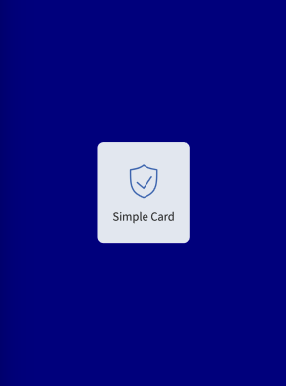
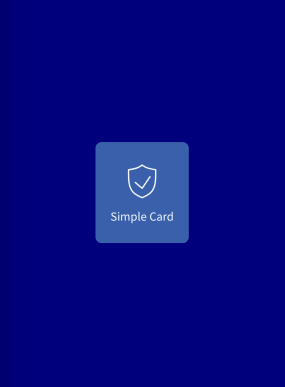

You can use simple cards as **a short-cut entry action to another information section** in your mobile application. Color of Background and Text of SimpleCard will change when pressed.




### Usage

````javascript
const MyComponent = () => (
  <SimpleCard icon={someIcon} text="Simple Card" primary onPress={() => console.log('Pressed')}>
);

````


## Props 

### text
Type: String

Text to display for the Card._

### icon
Type: IconSource

_Icon to display for the Card._


### onPress
Type: () => void

_Function to execute on press._


